# Agentic AI Platform — Production Implementation Guide

This is the implementation-depth companion to the architecture study guide. Each section names concrete technologies, shows representative config/code patterns, and calls out the failure modes and decisions that separate a working prototype from a production system.

### End-to-End Request Flow (System-Level View)

Before diving into each layer, it helps to see how a single request travels through the *entire* stack. This is the diagram to draw first on a whiteboard in a system design interview — everything else in this guide is a zoom-in on one box below.

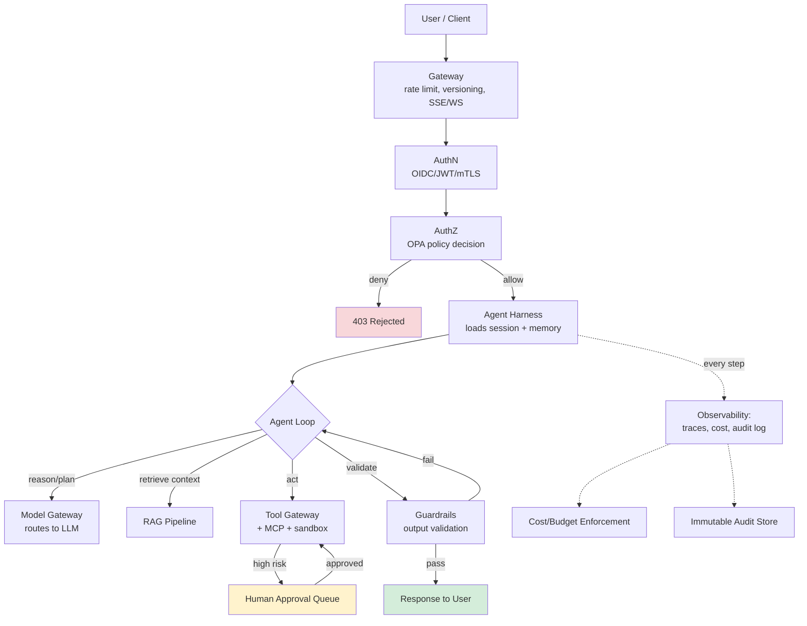

**How to read this diagram:** the solid arrows are the *happy path* a request takes; the dotted arrows are *cross-cutting observation* that happens in parallel at every single step, not just at the end. The single most important thing to internalize: **the Agent Loop is not one call — it's a cycle that repeatedly calls out to Model, RAG, and Tools, with Guardrails able to send it back around the loop rather than terminating.** Interviewers often probe whether candidates understand this is a loop with re-entry points, not a linear pipeline.

---

## 1. Gateway & Client Layer

**Stack choices:** Kong, Envoy, AWS API Gateway, or a custom FastAPI/Node edge service behind a load balancer. For streaming agent responses, use **Server-Sent Events (SSE)** for one-way token streaming (simpler, works through most proxies) or WebSockets when the client needs bidirectional interrupt/steer capability mid-run.

**Rate limiting implementation — token bucket, per-identity:**
```python
# Redis-backed token bucket, atomic via Lua script
LUA_TOKEN_BUCKET = """
local key = KEYS[1]
local capacity = tonumber(ARGV[1])
local refill_rate = tonumber(ARGV[2])  -- tokens/sec
local now = tonumber(ARGV[3])
local requested = tonumber(ARGV[4])

local bucket = redis.call('HMGET', key, 'tokens', 'ts')
local tokens = tonumber(bucket[1]) or capacity
local ts = tonumber(bucket[2]) or now

local delta = math.max(0, now - ts)
tokens = math.min(capacity, tokens + delta * refill_rate)

if tokens >= requested then
  tokens = tokens - requested
  redis.call('HMSET', key, 'tokens', tokens, 'ts', now)
  redis.call('EXPIRE', key, 3600)
  return 1
else
  redis.call('HMSET', key, 'tokens', tokens, 'ts', now)
  return 0
end
"""
```
**Why token bucket over fixed window:** fixed windows allow 2x burst at window boundaries; token bucket smooths it. Rate-limit on **three dimensions simultaneously**: requests/sec (abuse), tokens/min (cost), and concurrent agent runs (resource exhaustion) — a single dimension under-protects.

**API versioning:** URL-path versioning (`/v2/agents/run`) for breaking changes; header-based (`X-Agent-Schema-Version`) for prompt/tool-schema evolution that clients need to negotiate without a full API bump.

**Session management:** Sticky sessions only if the agent runtime is stateful in-process (anti-pattern at scale). Prefer **stateless compute + externalized state** (Redis/Postgres) so any pod can serve any request — critical for autoscaling and for surviving pod restarts mid-agent-run.

**Why this layer is more than "just a proxy":** in a normal web app, the gateway's job is basically routing + throttling. In an agentic system it does one extra critical thing — it's the **cost circuit breaker of last resort**. Agent runs are expensive and can be long-lived (seconds to minutes, not milliseconds), so the gateway needs request-level timeouts that are much longer than a typical REST timeout, but still bounded — otherwise a single hung client connection can pin a backend worker indefinitely. A common production pattern: the gateway accepts the request, immediately returns a `run_id`, and the client polls or subscribes via SSE — decoupling "did the request get accepted" from "is the agent still working," which avoids the whole problem of picking one timeout value that's right for every agent task.

---

## 2. Authentication

**Human auth:** OIDC via Auth0/Okta/Keycloak → short-lived JWT (5–15 min access token + refresh token). Validate signature via JWKS endpoint, cache JWKS keys with a 24h TTL and background refresh.

**Agent-to-agent / service auth — the part people get wrong:** Do not reuse a static API key across all agent-to-service calls. Use one of:
- **mTLS with SPIFFE/SPIRE** — each agent workload gets a cryptographic identity (SVID) issued by a workload identity provider, rotated automatically (minutes-to-hours TTL). This is the production-grade answer for "how does Agent A prove to Tool Service B who it is."
- **Short-lived JWTs issued by an internal STS** (e.g., a Vault-backed token exchange) scoped to a single agent run ID, expiring when the run completes.

**Delegation pattern (important for agentic systems):** When Agent A calls Tool B *on behalf of user U*, the token passed must encode **both** the agent's identity **and** the original user's identity/scope (an OAuth "token exchange" / RFC 8693 pattern), so downstream authorization can enforce "this agent may only do what this user is allowed to do" — never let the agent's own broader service credentials leak through to user-scoped actions.

```python
# Token exchange request (RFC 8693) — agent exchanges its own credential
# + user's token for a narrowly-scoped downstream token
POST /oauth/token
grant_type=urn:ietf:params:oauth:grant-type:token-exchange
subject_token=<user_jwt>
actor_token=<agent_service_jwt>
requested_scope=tool:crm:read
```

**Why token exchange, and not "just pass the user's token straight through"?** Two reasons senior interviewers probe for:
1. **Scope narrowing.** The user's original token might have broad scope (`read:all_crm`), but this particular agent action only needs `tool:crm:read` for one customer record. Token exchange lets you mint a token with the *minimum* scope needed for this specific downstream call — least privilege enforced per-call, not per-session.
2. **Traceability.** The exchanged token still carries the `actor` (agent) and `subject` (user) as distinct claims, so an audit log entry can always answer "which agent did this, acting for which user" — passing the raw user token through loses the agent's own identity from the trail.

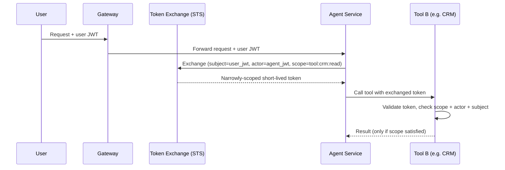

---

## 3. Authorization / Policy Engine

**Production choice: Open Policy Agent (OPA) with Rego, or AWS Cedar** for policy-as-code. Deploy OPA as a **sidecar** next to each service (sub-millisecond local decision, no network hop) with policies pushed via bundle API from a central policy repo (GitOps).

```rego
package agent.authz

default allow = false

allow {
    input.action == "tool.invoke"
    input.tool.risk_level == "low"
    input.user.role in {"analyst", "admin"}
}

allow {
    input.action == "tool.invoke"
    input.tool.risk_level == "high"
    input.approval.status == "human_approved"
    input.approval.approver != input.user.id   # no self-approval
}

deny_reason = "tool_not_in_allowlist_for_tenant" {
    not input.tool.id in data.tenant_allowlists[input.tenant_id]
}
```

**Decision caching:** Cache allow/deny decisions per (identity, action, resource) tuple with a short TTL (10–30s) to avoid re-evaluating identical policy checks in a tight agent loop — but **never cache human-approval-gated decisions**.

**Policy testing in CI:** Treat Rego policies like code — unit test with `opa test`, require PR review, and run a policy simulation against historical traffic before rollout to catch unintended denials/allows.

**Where the sidecar sits, concretely:** every service that needs an authz decision (the harness, the tool gateway, the RAG retriever if it gates access to sensitive documents) has its own OPA sidecar container in the same pod. This means the policy decision never crosses a network boundary to a shared central service in the hot path — you get microsecond decisions instead of round-trip latency, while the *policy bundle itself* is still centrally authored and pushed out to every sidecar, so you don't lose consistency for the sake of speed.

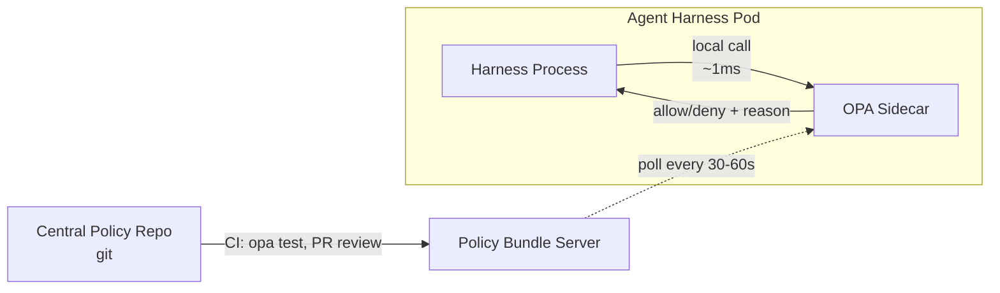

---

## 4. Agent Harness & Execution Loop

**Frameworks:** LangGraph, custom state machine on top of a durable execution engine (Temporal, AWS Step Functions), or a bespoke asyncio loop for simpler cases. For anything with retries/checkpointing/long-running tasks at production scale, **durable execution (Temporal)** is the strongest choice — it gives you crash-safe replay for free.

**Loop implementation sketch (Temporal-style workflow):**
```python
@workflow.defn
class AgentRun:
    @workflow.run
    async def run(self, goal: Goal) -> AgentResult:
        state = AgentState(goal=goal)
        for step in range(MAX_STEPS):
            plan = await workflow.execute_activity(
                reason_and_plan, state, start_to_close_timeout=timedelta(seconds=30)
            )
            if plan.is_complete:
                break

            action = await workflow.execute_activity(decide_action, state)

            if action.risk_level == "high":
                approved = await workflow.wait_condition(
                    lambda: state.approval_received, timeout=timedelta(hours=1)
                )
                if not approved:
                    state.terminate(reason="approval_timeout")
                    break

            observation = await workflow.execute_activity(
                execute_tool, action,
                retry_policy=RetryPolicy(maximum_attempts=3, backoff_coefficient=2.0),
            )
            valid = await workflow.execute_activity(validate_observation, observation, state.goal)
            state.update(action, observation, valid)

            # checkpoint is implicit — Temporal persists workflow state every step
        return state.finalize()
```
**Why this matters at production level:** each `execute_activity` call is independently retried, timed out, and logged by the workflow engine. If the process crashes at step 7 of 12, Temporal replays from the last completed step — you get checkpoint/resume "for free" instead of hand-rolling a state-persistence layer.

**Termination controller specifics:** hard cap on steps (e.g., 25), hard cap on wall-clock time, hard cap on cumulative token spend per run, and a **loop-detection check** (hash the last N actions; if a cycle repeats identically 3x, terminate — this is the #1 cause of runaway cost incidents).

**The loop as a state machine.** It's easy to describe Reason→Plan→Decide→Act→Observe→Validate as a straight line, but production agents need explicit re-entry edges: validation failure sends you back to Reason (not just "try again" on Act), and a failed tool call can trigger *replanning* rather than a blind retry of the same plan. Drawing this as a state machine (not a pipeline) is what makes the termination conditions obvious — every state needs its own exit condition, or you can get stuck cycling between Plan and Validate forever without ever hitting a step-count check if that check only lives at the top of the loop.

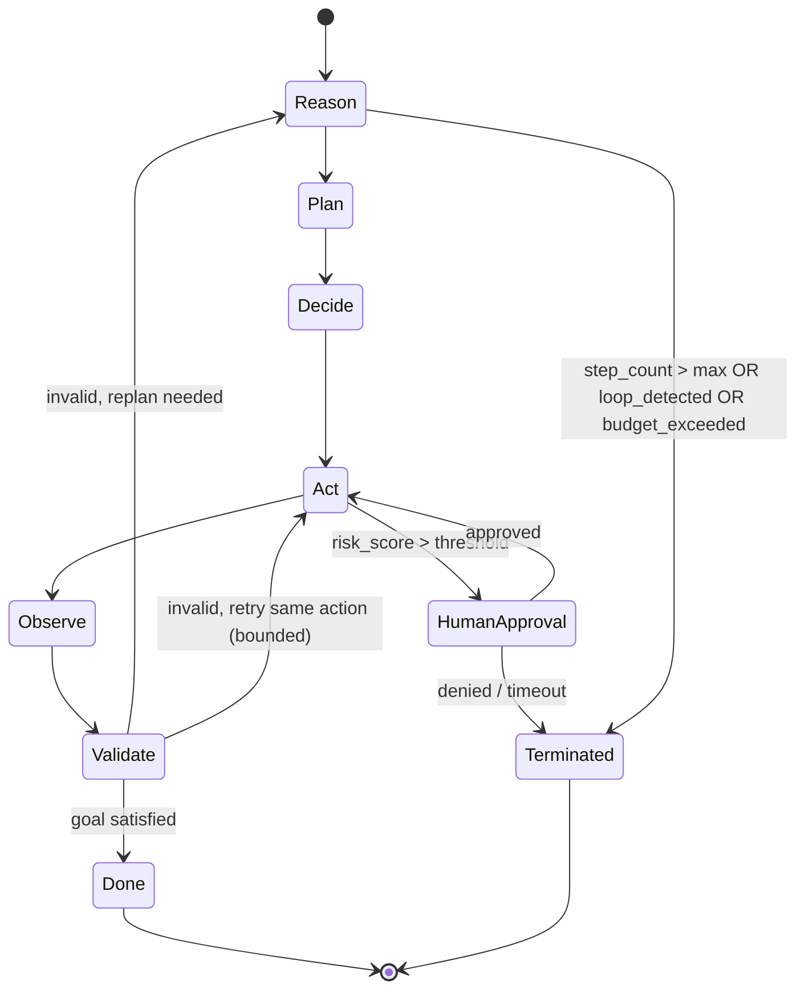

**Why durable execution engines (Temporal) are worth the operational overhead:** without one, you'd hand-roll this exact state machine's persistence — writing state to Redis/Postgres after every transition, wrapping every external call in try/except/retry logic, and building your own "resume from last state" logic on crash recovery. Temporal (or Step Functions) gives you this by construction: the workflow definition *is* the state machine, and the engine handles persistence, retry, and replay. The trade-off is operational complexity (running/operating the Temporal cluster) and a steeper learning curve for the team — for a low-stakes/low-volume agent, a simpler hand-rolled loop with Postgres checkpointing is a defensible choice; the durable-engine investment pays off once you have many concurrent long-running agent workflows.

---

## 5. State & Memory

| Tier | Storage | TTL | Access pattern |
|---|---|---|---|
| Session state | Redis (in-memory) | Life of session | Read/write every step |
| Short-term/working memory | In-process object, checkpointed to Redis | Life of agent run | Read/write every step |
| Long-term memory | Postgres (structured) + vector DB (semantic) | Persistent | Retrieved selectively via embedding similarity |
| Checkpoints | Postgres/S3 (durable engine handles this if using Temporal) | Persistent, per-run | Write every step, read only on resume |

**Long-term memory retrieval pattern:** don't replay raw history. Summarize each session into a structured memory record (facts, preferences, unresolved items) using a cheap model, embed the summary, and retrieve top-k relevant memories at the start of a new session — bounded to a fixed token budget (e.g., 500 tokens of memory max).

**Memory write-back is a guardrail surface too:** validate/sanitize before writing agent-derived "facts" into long-term memory — a hallucinated fact that gets persisted becomes a recurring error in every future session (memory poisoning).

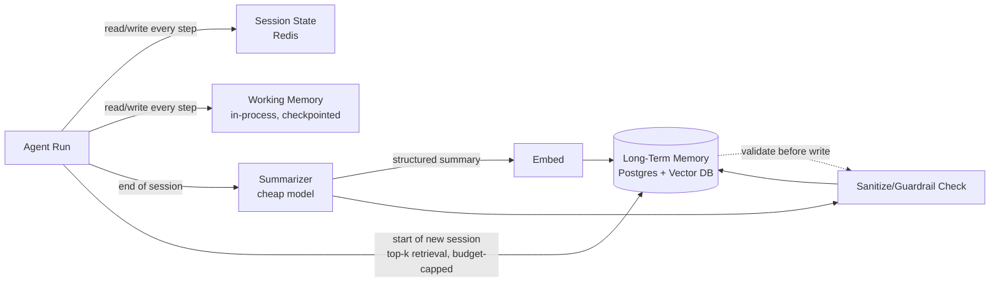

**Concrete numbers to anchor this:** a typical production system caps retrieved long-term memory at 300–800 tokens (a small fraction of a 100K+ context window), caps working memory at whatever the current task's tool outputs actually require (often the single largest consumer of context, since raw API/DB responses can be verbose — truncate or summarize tool outputs before they enter working memory, don't just dump raw JSON), and treats session state as ephemeral and cheap to lose (a dropped session should be recoverable from long-term memory + checkpoint, not catastrophic).

---

## 6. Guardrails & Safety

**Concrete tool stack:**
- **Input/output moderation:** Llama Guard, OpenAI Moderation API, or Azure AI Content Safety.
- **PII detection/redaction:** Microsoft Presidio (regex + NER-based), run on both input and tool outputs before they re-enter the context window.
- **Prompt injection detection:** a dedicated classifier model (e.g., a fine-tuned DeBERTa) scoring incoming text (user input **and** retrieved documents/tool outputs) for injection patterns; block or flag above a threshold.
- **Schema/structured-output guardrails:** Pydantic/JSON-schema validation on every tool call the model proposes — reject and re-prompt if the LLM's tool call doesn't conform, rather than executing malformed calls.

```python
class ToolCall(BaseModel):
    tool_name: Literal["send_email", "query_db", "delete_record"]
    parameters: dict
    justification: str

    @field_validator("parameters")
    def validate_against_schema(cls, v, info):
        schema = TOOL_REGISTRY[info.data["tool_name"]].input_schema
        jsonschema.validate(v, schema)  # raises on mismatch
        return v
```

**Risk scoring gate (feeds human-in-the-loop):**
```python
def risk_score(action: ToolCall) -> float:
    score = BASE_RISK[action.tool_name]
    if action.parameters.get("amount", 0) > APPROVAL_THRESHOLD:
        score += 0.4
    if action.tool_name in DESTRUCTIVE_TOOLS:
        score += 0.3
    return min(score, 1.0)

# score > 0.7 -> route to human approval queue before Act stage
```

**Defense-in-depth checklist (interview-ready):** validate at (1) user input, (2) each RAG-retrieved chunk, (3) each tool call proposal before execution, (4) each tool result before it re-enters context, (5) final output before returning to user. Missing #2 and #4 is the most common production gap — teams guard the edges and forget the middle.

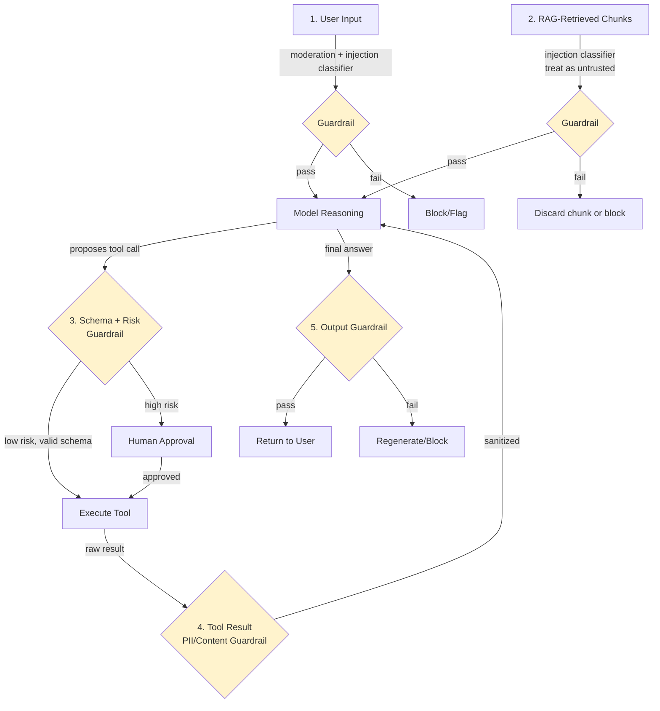

**The most-missed attack surface, spelled out:** teams reliably build guardrail #1 (user input) and #5 (final output) because those map cleanly onto "moderate the request, moderate the response" — the pattern everyone already knows from non-agentic chatbots. Guardrails #2 and #4 are missed because they require realizing that **anything the model reads is effectively a prompt**, whether it came from the user, a retrieved document, or a tool's API response. A malicious instruction embedded in a PDF the RAG pipeline retrieves, or in the text field of a ticket a tool fetches, is just as capable of hijacking the agent's next action as a malicious user message — and it bypasses guardrail #1 entirely because it never touched the user input path.

---

## 7. Prompt & Context Management

**Versioning:** store prompts as files in git (not in a database blob), reviewed via PR, tagged by semantic version. Use a prompt registry (e.g., LangSmith Hub, PromptLayer, or a simple internal service) that resolves `prompt_id@version` at runtime so you can A/B test or roll back a specific prompt without a code deploy.

**Templating:** Jinja2 or f-string templates with strict variable validation (fail loudly on missing variables rather than silently rendering `None`).

**Context budget algorithm (concrete):**
```python
def build_context(budget_tokens: int, components: list[ContextComponent]) -> str:
    # priority order: system prompt > tool defs > current task > recent turns > memory > RAG
    allocated = []
    remaining = budget_tokens
    for c in sorted(components, key=lambda x: x.priority):
        c_tokens = count_tokens(c.render())
        if c.required and c_tokens > remaining:
            raise ContextBudgetExceeded(c.name)
        if c_tokens <= remaining:
            allocated.append(c)
            remaining -= c_tokens
        elif c.compressible:
            compressed = compress(c, remaining)
            allocated.append(compressed)
            remaining -= count_tokens(compressed.render())
    return assemble(allocated)
```
**Senior nuance:** compress by *summarizing* low-priority long-tail context (older conversation turns) rather than truncating — truncation silently drops information and produces confidently wrong answers; summarization degrades gracefully.

**A worked example of the budget in practice**, for a model with a 128K context window and a working reserve of 8K tokens for the model's own output:

| Component | Typical allocation | Priority | Compressible? |
|---|---|---|---|
| System prompt + tool definitions | 2K–4K | Highest (required) | No |
| Current task/goal | ~200 | Highest (required) | No |
| Recent conversation turns | 4K–10K | High | Summarize oldest first |
| Retrieved RAG chunks | 2K–6K | Medium | Drop lowest-ranked first |
| Long-term memory | 300–800 | Medium | Summarize further |
| Tool call results (current step) | Variable, often largest | High while active | Truncate/summarize verbose JSON |

Notice tool results are the wildcard — a single verbose API response can blow the entire budget if not summarized before being appended to context, which is why production systems often run a small "compress this tool output to the relevant fields" pass immediately after every tool call rather than passing raw responses straight into the next reasoning step.

---

## 8. RAG Pipeline

**Ingestion stack:** Unstructured.io or LlamaParse for parsing (PDF/DOCX/HTML) → semantic chunking (not fixed 512-token windows — split on section boundaries, target 200–500 tokens with 10–15% overlap) → embedding (OpenAI `text-embedding-3-large`, Cohere `embed-v3`, or a domain-tuned open model) → **pgvector** (if already on Postgres, simplest ops story), **Weaviate**, or **Pinecone** for scale.

**Retrieval pattern — hybrid search + rerank, the production standard:**
```python
def retrieve(query: str, k: int = 20, final_k: int = 5) -> list[Chunk]:
    vector_hits = vector_db.search(embed(query), top_k=k)
    keyword_hits = bm25_index.search(query, top_k=k)          # catches exact terms/IDs vector search misses
    merged = reciprocal_rank_fusion(vector_hits, keyword_hits)
    reranked = cross_encoder_rerank(query, merged, top_k=final_k)  # e.g. Cohere Rerank
    return [c for c in reranked if c.score > RELEVANCE_THRESHOLD]
```
**Why hybrid:** pure vector search misses exact-match needs (SKUs, error codes, names); pure keyword search misses semantic paraphrase. Reciprocal rank fusion combines both cheaply before the expensive reranking step.

**Freshness/versioning:** tag chunks with `source_version` and `ingested_at`; re-embed on source change via a change-data-capture pipeline (not a full nightly re-index at scale) — stale RAG content is a top production quality complaint.

**Grounding/citation enforcement:** require the model to output chunk IDs alongside claims; validate post-hoc that cited chunk IDs were actually in the retrieved set (catches citation hallucination) — this feeds directly into the Evaluation layer's "grounding/citation" metric.

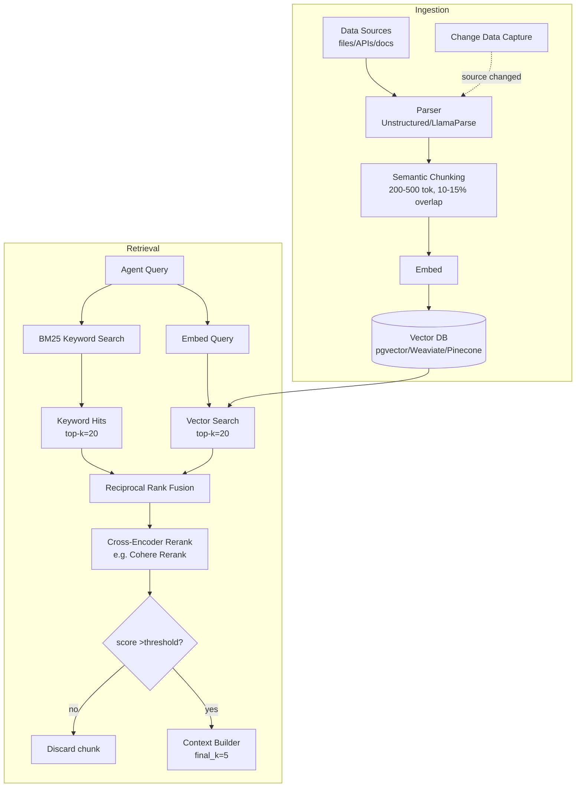

**Why the two-stage retrieve-then-rerank design specifically, spelled out with the intuition:** vector search over millions of chunks has to be fast, so it uses a cheap similarity metric (cosine distance on embeddings) — this is optimized for *recall* (don't miss relevant chunks) but is noisy on *precision* (some irrelevant chunks sneak into the top 20). A cross-encoder reranker is far more accurate at judging true relevance because it looks at the query and chunk *together* (not as separate pre-computed vectors), but it's too slow to run over the whole corpus — so you use the cheap/fast method to get a shortlist of ~20, then the slow/accurate method to pick the best 5 from that shortlist. This two-speed design (cheap-broad then expensive-narrow) recurs throughout the whole architecture, not just RAG — it's the same idea behind cheap-model-for-routing/expensive-model-for-reasoning in the Model Layer.

---

## 9. Tooling, MCP & Sandboxing

**Tool registry:** a versioned catalog (OpenAPI-style schema per tool) stored in a service/DB, not hardcoded in prompts — enables dynamic tool discovery and per-tenant tool allowlists.

**MCP implementation pattern:**
```python
# MCP server exposing a tool
@mcp_server.tool()
async def query_crm(customer_id: str, fields: list[str]) -> dict:
    """Fetch CRM fields for a customer. Requires crm:read scope."""
    authz.check(current_identity(), action="crm.read", resource=customer_id)
    return await crm_client.get(customer_id, fields)

# Agent-side MCP client discovers and calls tools without hardcoded integration
tools = await mcp_client.list_tools()
result = await mcp_client.call_tool("query_crm", {"customer_id": "123", "fields": ["email"]})
```
**Why MCP matters at production scale:** tool *providers* (internal platform teams) and tool *consumers* (agent teams) can ship independently — the protocol is the contract, not a shared codebase. This is the same value proposition as a service mesh: decoupling via a standard interface.

**Sandboxing for code-execution tools:** never run agent-generated code in the same trust boundary as the orchestrator. Use gVisor or Firecracker microVMs (what AWS Lambda/Fargate use under the hood) with:
- No network egress by default (explicit allowlist).
- CPU/memory/time limits enforced by the runtime, not the application.
- Ephemeral filesystem, destroyed after execution.

**Tool-call rate limiting is per-tool, not just per-user:** a single agent looping can hammer one downstream API even within an otherwise reasonable overall rate limit — enforce limits at the Tool Gateway keyed by `(tool_id, tenant_id)`.

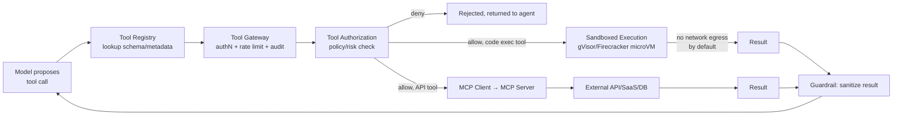

**The sandbox is a hard trust boundary, not a soft one.** A useful mental model: treat every agent-generated code execution the same way you'd treat running code submitted by an anonymous internet user — because functionally, that's what it is (the model can be manipulated via prompt injection into generating arbitrary code). This is why the microVM's network egress defaults to *closed* rather than open-with-an-blocklist: an allowlist-first posture means a new, unanticipated exfiltration path doesn't silently work by default — it has to be explicitly granted.

---

## 10. Model Layer

**Production pattern: LiteLLM (or a custom equivalent) as a unified model gateway** — normalizes the API shape across OpenAI/Anthropic/Bedrock/Azure/self-hosted vLLM, so application code calls one interface regardless of provider.

```python
router_config = {
    "routing_strategy": "latency-based",  # or cost-based, least-busy
    "model_list": [
        {"model_name": "reasoning", "litellm_params": {"model": "anthropic/claude-opus-4-8"}},
        {"model_name": "general",   "litellm_params": {"model": "openai/gpt-5"}},
        {"model_name": "general",   "litellm_params": {"model": "bedrock/anthropic.claude-sonnet-5"}},  # fallback
    ],
    "fallbacks": [{"general": ["general-bedrock-backup"]}],
    "timeout": 30,
    "num_retries": 2,
}
```
**Task-based routing:** classify task complexity cheaply (a small model or heuristic) before routing to the expensive reasoning model — e.g., simple extraction tasks go to a fast/cheap model, multi-step planning goes to a frontier reasoning model. This is where most of the cost savings in FinOps actually come from.

**Provider outage handling:** automatic fallback chain (primary → secondary provider → cached/degraded response) with circuit breaker so a slow provider doesn't cascade into timing out the whole agent run.

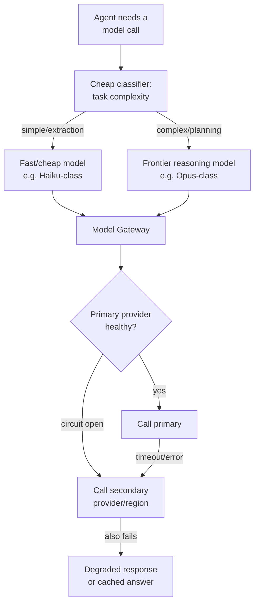

**The cost impact of task-based routing, made concrete:** if 70% of an agent's model calls are simple classification/extraction steps and only 30% are genuine multi-step reasoning, routing the 70% to a model that's roughly 10–20x cheaper than the frontier reasoning model can cut total model spend by more than half without touching quality on the calls that matter — this single design decision is usually the highest-leverage FinOps lever available, ahead of prompt-length optimization or caching.

---

## 11. Observability

**Stack:** OpenTelemetry for traces/spans (vendor-neutral), exported to Langfuse, LangSmith, Arize Phoenix, or a general APM (Datadog/Honeycomb) with LLM-specific span attributes.

**Trace structure — every agent run is one trace, every loop iteration is a span:**
```python
with tracer.start_as_current_span("agent_run", attributes={"goal": goal.id, "user_id": user.id}) as run_span:
    for step in range(max_steps):
        with tracer.start_as_current_span(f"step_{step}") as step_span:
            step_span.set_attribute("reasoning_tokens", plan.token_count)
            with tracer.start_as_current_span("tool_call", attributes={"tool": action.tool_name}):
                observation = execute_tool(action)
            step_span.set_attribute("validation_result", valid.status)
```
**What must be captured per step (non-negotiable for debugging autonomous agents):** full prompt sent to the model, full raw model output, tool call + parameters, tool result, validation verdict, latency, token counts, and model/version used. Store this in a structured log store (not just APM sampling) since you need 100% of agent traces for incident review, not a sampled subset.

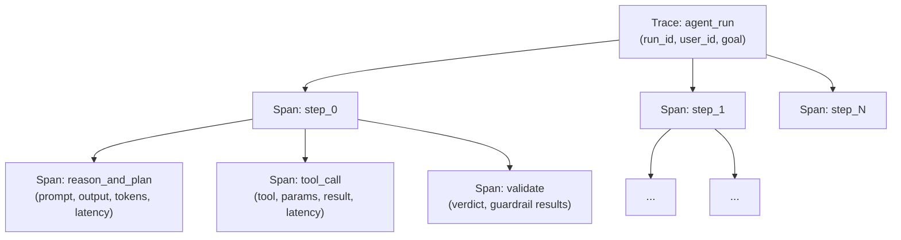

**Why 100% capture instead of sampling, spelled out:** normal microservices can sample traces (e.g., 1% of requests) because failures tend to be statistically similar across requests, and volume is high enough that a sample still catches patterns. Agent runs are lower-volume, higher-stakes, and each one is a *unique reasoning path* — the specific run that went wrong is exactly the one you need the full trace for, and by definition you don't know in advance which run that will be. This is the same logic as why you don't sample audit logs — the cost of storing full traces is usually far lower than the cost of an unreproducible incident.

---

## 12. Cost Management & FinOps

**Token accounting middleware — enforced, not just logged:**
```python
async def enforce_budget(tenant_id: str, estimated_tokens: int):
    spent = await redis.get(f"budget:{tenant_id}:{today()}")
    if spent + estimated_tokens * COST_PER_TOKEN[model] > DAILY_BUDGET[tenant_id]:
        raise BudgetExceededError(tenant_id)
    await redis.incrby(f"budget:{tenant_id}:{today()}", estimated_tokens)
```
Run this **before** the model call, using a token estimate, then reconcile with actual usage after — pre-flight checks prevent runaway spend better than after-the-fact alerting.

**FinOps allocation:** tag every LLM/tool call with `tenant_id`, `team_id`, `feature_id` at the point of the call (propagated via context, not reconstructed later from logs) so cost-per-business-outcome reporting is queryable directly rather than requiring log archaeology.

---

## 13. Evaluation & Feedback

**Eval harness:** promptfoo, Ragas (RAG-specific: faithfulness, answer relevancy, context precision/recall), or a custom eval suite running against a **golden dataset** of representative tasks with known-good outcomes.

**CI gate pattern:**
```yaml
# .github/workflows/agent-eval-gate.yml
- name: Run eval suite against golden dataset
  run: python -m evals.run --suite regression --model ${{ env.CANDIDATE_MODEL }}
- name: Fail if quality regresses
  run: python -m evals.compare --baseline main --candidate ${{ env.CANDIDATE_MODEL }} --threshold -0.02
```
No prompt, model, or RAG-config change ships without passing this gate — this is the direct implementation of the "Agent Evaluation Gate" box in the deployment pipeline.

**Feedback loop:** thumbs up/down + free-text captured at the point of interaction, written to a feedback store keyed by trace ID, reviewed in a weekly triage that feeds directly back into the golden dataset (failed interactions become new eval cases — this is how eval suites stay relevant instead of going stale).

---

## 14. Reliability & Resilience

**Circuit breaker (per tool/model provider):**
```python
class CircuitBreaker:
    def __init__(self, failure_threshold=5, reset_timeout=30):
        self.failures = 0
        self.state = "closed"
        self.opened_at = None

    async def call(self, fn, *args):
        if self.state == "open":
            if time.time() - self.opened_at > self.reset_timeout:
                self.state = "half_open"
            else:
                raise CircuitOpenError()
        try:
            result = await fn(*args)
            if self.state == "half_open":
                self.state = "closed"
                self.failures = 0
            return result
        except Exception:
            self.failures += 1
            if self.failures >= self.failure_threshold:
                self.state = "open"
                self.opened_at = time.time()
            raise
```
**Retry policy:** exponential backoff with jitter, capped attempts (2–3 for tool calls, since agent loops already have their own outer retry semantics — retrying at both the HTTP layer and the agent-loop layer compounds latency badly if not capped).

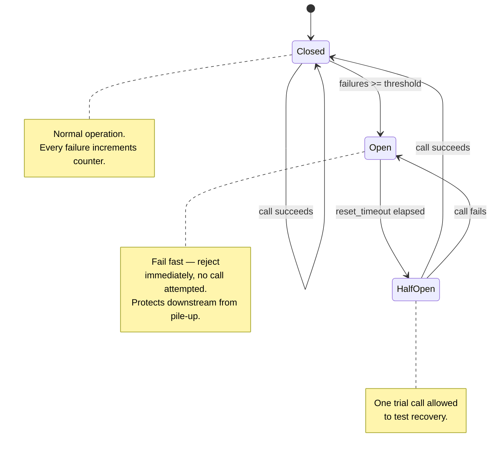

**The "fail fast" intuition, made explicit:** a naive retry-everything approach under a real outage makes things worse, not better — every failed call still consumes a connection slot and adds latency before it fails, so a struggling downstream service gets *more* load exactly when it can least handle it (retry storms are a classic cause of cascading outages). The circuit breaker's `Open` state trades a guaranteed-fast local failure for skipping calls that would likely fail anyway, giving the downstream service room to recover — this is why `Open` rejects instantly rather than attempting and timing out.

**Idempotency:** every tool call that mutates state must carry an idempotency key (derived from run_id + step number), so a retried call after a timeout doesn't double-execute (e.g., double-send an email, double-charge a payment).

**Multi-region:** active-active for stateless gateway/model-routing tiers; active-passive with async replication for stateful stores (Postgres) — full active-active state replication for agent memory is rarely worth the complexity unless you have strict regional data-residency + high-availability requirements simultaneously.

---

## 15. Infrastructure & Deployment

**Kubernetes patterns:** agent workers as a Deployment with HPA scaling on queue depth (not just CPU — agent workloads are I/O-bound waiting on model calls, so CPU-based autoscaling under-provisions). Use a service mesh (Istio/Linkerd) for mTLS between services, retries, and traffic shaping — this is what actually implements the "Agent-to-Agent Security" box from the governance panel at the network layer.

**Deployment pipeline stages:** build & test → agent evaluation gate (§13) → artifact registry (versioned prompt+model+tool config bundle, not just a container image — the *configuration* is the deployable unit for agents, code changes less often than prompts do) → canary release (Argo Rollouts, 5% traffic, auto-rollback on eval-metric or error-rate regression) → progressive rollout → full release.

**Rollback:** because prompts/configs are versioned artifacts (§7), rollback is a config pointer change, not a redeploy — this is what makes sub-minute rollback achievable for a bad prompt change.

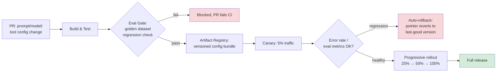

**The key insight that makes fast rollback possible:** because the *deployable unit* is a config bundle reference (a pointer to `prompt_v14 + model_v3 + tool_config_v7` in the registry), rolling back means updating one pointer in a fast key-value store, not rebuilding and redeploying a container image through the full CI/CD pipeline. This is a deliberate architectural choice — if prompts were embedded directly in application code, every prompt tweak would require a full code deploy, and rollback would take as long as a normal software rollback (minutes, sometimes longer with approval gates) instead of seconds.

---

## 16. Security, Audit, Compliance, Governance — Implementation Specifics

**Secrets management:** HashiCorp Vault or cloud KMS for all API keys/credentials; agents and tools fetch short-lived secrets at runtime, never embed static secrets in prompts or tool configs.

**Immutable audit log:** append-only store (e.g., S3 with Object Lock / WORM, or a dedicated audit service) — every authz decision, tool call, human approval, and model invocation written as a structured event with a cryptographic hash chain (each event includes the hash of the previous event) so tampering is detectable.

```json
{
  "event_id": "evt_9f2a...",
  "prev_hash": "a13f...",
  "timestamp": "2026-08-20T10:15:00Z",
  "actor": {"type": "agent", "id": "agent_run_882", "on_behalf_of": "user_44"},
  "action": "tool.invoke",
  "resource": "crm.customer.123",
  "decision": "allow",
  "policy_version": "v14",
  "hash": "b8e0..."
}
```

**Data residency/compliance:** route requests to region-pinned model deployments (e.g., EU customer data never leaves an EU-hosted model endpoint) enforced at the Model Gateway via tenant metadata, not just a policy document — compliance has to be a routing constraint, not only a written rule.

**Approval workflows (governance):** implemented as a durable workflow step (ties back to §4's Temporal pattern) with SLA timeout, escalation path, and mandatory two-person rule for the highest-risk action categories (no self-approval, enforced in the OPA policy from §3).

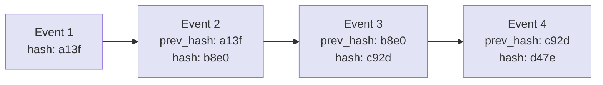
**Why the hash chain, specifically:** each event stores the hash of the event before it, so altering or deleting any single historical event breaks the hash of every event after it — an auditor can verify integrity by recomputing the chain rather than trusting that the storage layer was never tampered with. This is the same core idea as a blockchain's append-only ledger, applied at a much smaller scale (a single audit log stream, not a distributed consensus system) — you get tamper-evidence without needing the complexity of actual distributed consensus.

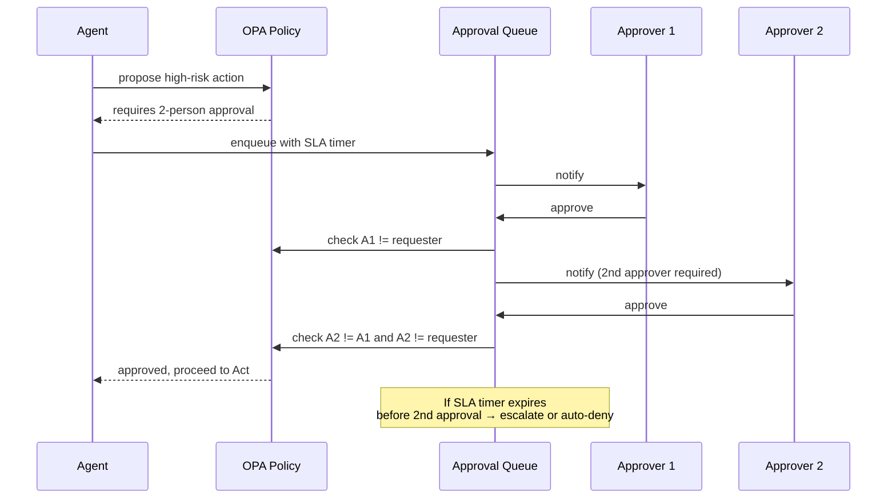

---

## Summary: The Production-vs-Prototype Delta

| Concern | Prototype | Production |
|---|---|---|
| State | In-memory, lost on restart | Externalized, checkpointed, crash-safe (Temporal/Redis/Postgres) |
| Auth | One shared API key | Per-identity OIDC/mTLS + token exchange for delegation |
| Tools | Hardcoded function calls | MCP-based registry, sandboxed execution, per-tool rate limits |
| Guardrails | Output filter only | Layered at input, RAG, tool-call, tool-result, output |
| Cost | Logged after the fact | Pre-flight enforced budgets per tenant |
| Prompts | Inline strings in code | Versioned artifacts, eval-gated CI/CD, instant rollback |
| Observability | Basic request logs | Full per-step tracing, 100% capture, structured for replay |
| Governance | Ad hoc | Policy-as-code, immutable audit trail, two-person approval on high-risk actions |

This table is a strong closing answer to "how do you know when an agentic system is production-ready" in a senior interview.
